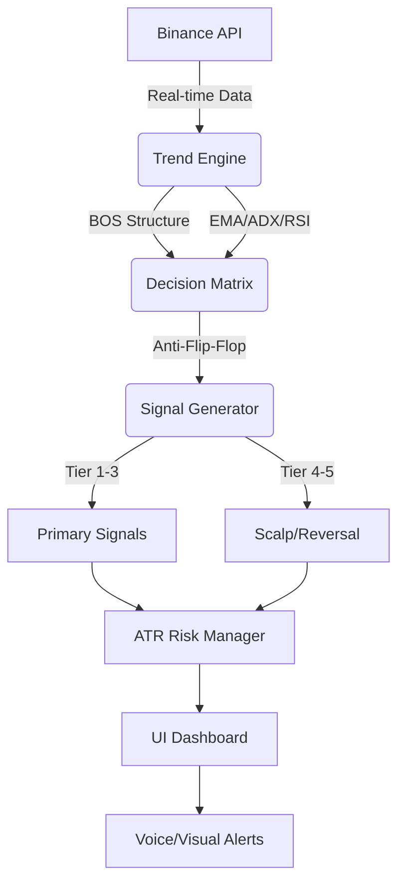

# 🌌 BTC-Omega: Professional Quantitative Trading Terminal


**BTC-Omega** is a high-precision Bitcoin trading terminal designed for professional traders and quantitative analysts. It leverages a deterministic hybrid engine to process multi-timeframe market data and generate high-confidence trading signals with dynamic risk management.

---

## 🚀 Key Features

### 🧠 Hybrid Quantitative Engine (v2.0)
- **Structure-First Detection**: Implements Break of Structure (BOS) detection (HH/HL, LL/LH) that overrides lagging indicators (EMAs) to identify reversals before they fully form on charts.
- **EMA Alignment**: Uses multi-period Exponential Moving Averages (21/50) to detect primary trend direction across H4, H1, M15, and M5 timeframes.
- **RSI Momentum Scoring**: Real-time Relative Strength Index analysis to identify overbought/oversold conditions and momentum shifts.
- **ADX Trend Strength**: Filters out sideways market conditions using Average Directional Index (ADX) thresholds.

### 🛡️ Multi-Timeframe (MTF) Intelligence
- **4-Tier Synchronization**: Analyzes H4 (Macro), H1 (Trend), M15 (Execution), and M5 (Timing) for maximum entry precision.
- **Anti-Flip-Flop System**: A specialized state-machine logic with a 3-candle confirmation buffer to filter out "market noise" and prevent false signal toggling during volatility.

### 📊 Professional Risk Management
- **Tier-Based Entry System**: Classifies signals into Tier 1 (High Confidence) to Tier 5 (Scalp/Speculative) based on timeframe alignment.
- **ATR Dynamic Volatility**: Calculates Average True Range (ATR) to automatically adjust Entry, Stop-Loss (SL), and Take-Profit (TP) levels.
- **Contextual Advice**: Real-time market sentiment analysis that provides actionable advice (e.g., "High Volatility detected - reduce lot size").

### 💎 Premium Terminal UI
- **Glassmorphism Design**: A sleek, modern dark-mode interface with translucent panels.
- **Real-time Data Streaming**: Sub-second updates via Binance Public API.
- **Audio Intelligence**: Voice-synthesized alerts for new high-probability trade setups.

---

## 🛠️ Tech Stack

- **Frontend**: React 18 (Functional Components, Hooks)
- **Language**: TypeScript (Strict Mode)
- **Styling**: Tailwind CSS
- **Data Source**: Binance Public REST & WebSocket API
- **Build Tool**: Vite

---

## 📦 Installation & Setup

1. **Clone the repository**
   ```bash
   git clone https://github.com/NexDesign-Agency/BTC-Omega.git
   cd BTC-Omega
   ```

2. **Install dependencies**
   ```bash
   npm install
   ```

3. **Run development server**
   ```bash
   npm run dev
   ```

---

## 📐 Architecture Overview



---

## 📄 Disclaimer

*This software is for educational and portfolio purposes only. Trading cryptocurrency involves significant risk. The developers are not responsible for any financial losses incurred from the use of this terminal. Always use proper risk management.*

---

**Developed with ❤️ for the Quantitative Trading Community.**
